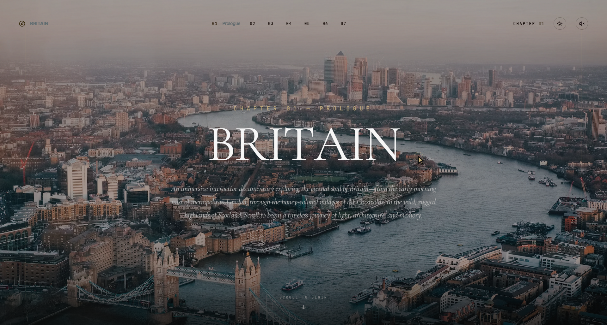

# 🇬🇧 Chronicle: A Cinematic Multimedia Journey

*An immersive interactive documentary across the timeless landscapes, historic architectures, and sensory stories of the United Kingdom.*



---

## 📖 Introduction
**Chronicle** is a high-fidelity web-based documentary crafted in modern React and Tailwind CSS. It takes users on an emotional and visual journey through the United Kingdom:
1. **The Awakening**: Morning fog over the metropolis.
2. **Victorian Legacy**: Classic London architecture juxtaposed with modern metropolis perspectives.
3. **Architectural Icons**: A cinematic showcase of historic landmarks like Tower Bridge, Big Ben, and Edinburgh Castle.
4. **The English Countryside**: Immersing the senses in the honey-colored Cotswolds and the Lake District.
5. **The Highlands of Scotland**: Traveling through the dramatic volcanic ruins of Glencoe and the Isle of Skye.
6. **Nightfall**: The River Thames under the starlit sky as the city sleeps.

Every element of the interface is carefully designed to mimic the rhythm of an elegant premium film reel, supported by ambient audio soundtracks and tactile micro-interactions.

---

## 🌟 Premium Custom Features

### 🔍 1. Detail-Zoom Lightbox Stage (Interactive Inspect Mode)
Clicking on any story-rich narrative image smoothly transitions the viewport into a fullscreen cinematic Inspect Mode:
- **Fluid Spring Entrances**: Uses physical springs (`stiffness: 220`, `damping: 30`) to bounce the image softly into place.
- **Double-Click Zoom**: Double-click (or double-tap) anywhere on the image to activate a high-fidelity detail lens ($1.6\times$ scale).
- **Drag-to-Pan**: Once zoomed in, users can grab and drag the image in real-time with flawless performance to inspect historical details.
- **AnimatePresence Exit Transitions**: Closing the lightbox triggers a synchronized soft fade-out and slide-down transition, maintaining high-fidelity design continuity.

### 🌀 2. Velocity-Responsive "Lens-Focus" Scroll Blur
To convey speed, momentum, and depth of field, the application features a dynamic backdrop overlay:
- **Real-Time Velocity Capture**: Tracks vertical scroll velocity using microsecond performance counters (`performance.now()`).
- **Dynamic Backdrop Filters**: Computes scroll energy and maps it to a beautiful, realistic blur value (up to `6px`).
- **Smooth Inertia Decay Loop**: Built with high-performance `requestAnimationFrame` hooks and linear interpolation (lerp). When scrolling slows down, the screen gently returns to focus.

### 🎭 3. Cinematic GSAP Theme Cross-Fade
Rather than an immediate, jarring color shift when switching between **Dark Mode (Midnight Ink)** and **Light Mode (Warm Parchment)**, we engineered a dreamlike, cross-faded theme transition:
- **GSAP Custom Property Interpolation**: Smoothly animates root CSS variables (`--bg-primary`, `--border-primary`, `--text-primary`, `--text-accent`) over a `1.2` second duration.
- **Atmospheric Preservation**: Gently fades background canvases, borders, and typography simultaneously to simulate film-development exposures.

### 🎯 4. Responsive Trailer Cursor
A custom cursor acts as the user's focus tool:
- **Aura Trailer**: A soft, gold circular halo trailing the primary pointer coordinates with a dampening spring curve.
- **Context-Aware States**: Detects when hovering over zoomable images and smoothly scales the cursor outward while fading in elegant `ZOOM` text details.

### 🎵 5. Multi-Track Ambience Engine
Includes a beautiful spatial soundtrack manager containing crackling vinyl grain, wind effects, and atmospheric chapter-specific melodies that can be toggled on/off.

---

## 🛠️ Core Tech Stack

- **Framework**: React 18, TypeScript, Vite
- **Styling**: Tailwind CSS (with highly customized CSS Variables for fluid theme interpolation)
- **Animation Library**: Framer Motion (`motion/react`) for layout elements, spring interactions, and modal unmounts
- **Transitions Engine**: GSAP (GreenSock Animation Platform) for cinematic property cross-fades
- **Physics-based Scroll**: Lenis Smooth Scroll for uniform, luxury speed distribution
- **Icons**: Lucide React
- **Background Visuals**: Three.js Canvas with ambient particle fields

---

## 📂 Code Structure & Key Modules

```bash
├── src
│   ├── components
│   │   ├── Lightbox.tsx           # Fullscreen spring-animated zoom/pan inspect stage
│   │   ├── CinematicOverlay.tsx   # Film-grain and velocity-responsive "lens-focus" blur
│   │   ├── CustomCursor.tsx       # Dynamic, context-sensitive spring pointer trailer
│   │   ├── Navbar.tsx             # Interactive header controls (audio & theme switch)
│   │   ├── ParallaxImage.tsx      # Smooth load states with zoom cursor triggers
│   │   ├── ThreeBackground.tsx    # Immersive particle and ambient lighting canvas
│   │   └── Chapter*.tsx           # Individual cinematic documentary acts
│   ├── utils
│   │   └── haptics.ts             # Micro-haptics framework for scroll transitions
│   ├── App.tsx                    # Main orchestrator, theme manager, and scroll handler
│   └── index.css                  # Typography configuration and Tailwind base styles
```

---

## 🚀 Getting Started

### 1. Installation
Install project dependencies securely using npm:
```bash
npm install
```

### 2. Development Mode
Boot the live Vite development server on port 3000:
```bash
npm run dev
```

### 3. Production Compilation
Compile the applet into an optimized static production package inside `/dist`:
```bash
npm run build
```
